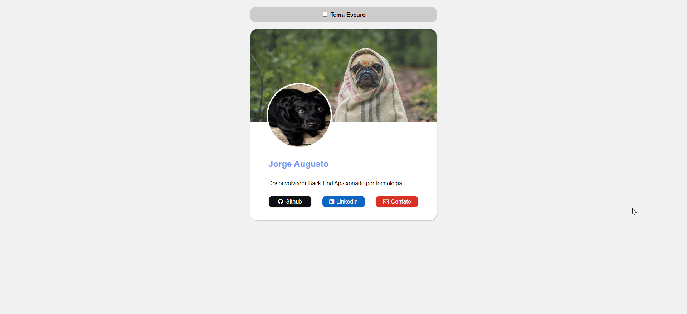

<h1 align="center">Dark Mode  </h1>

 

## 📑 Auxiliares

* Repositorio de referencia [Douglash93](https://github.com/douglash93/darkmode-css)
* Imagem utilizada de [Picsum](https://picsum.photos/)

* Playlist do Projeto [Dark Mode com HTML e CSS](https://www.youtube.com/playlist?list=PLEuLN871skK5YEhkJgNESZwV9-yb80GLo)
